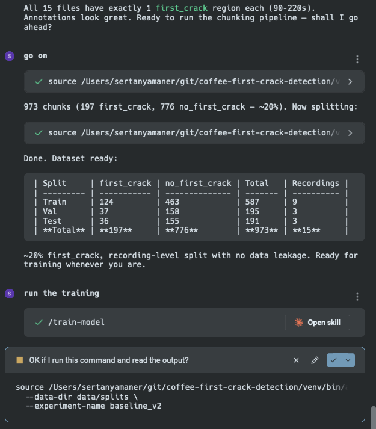
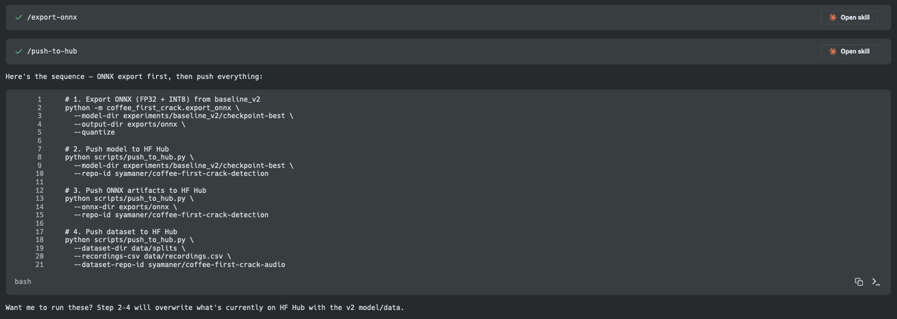
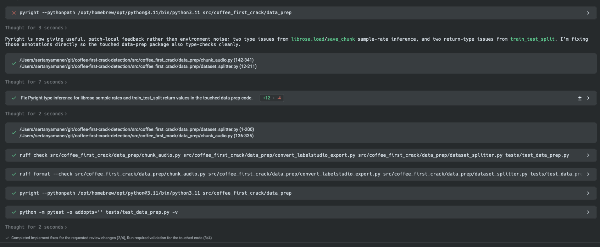

This is a live [Gradio Space](https://huggingface.co/spaces/syamaner/coffee-first-crack-detection) classifying coffee roasting audio in real time. The model behind it — an Audio Spectrogram Transformer fine-tuned on the first public audio dataset for coffee roasting, which I built from scratch — hits **97.4% test accuracy** and **100% precision** on first crack detection. It runs on a Raspberry Pi 5 at 2.09 seconds per 10-second window. The full pipeline — data preparation, training, evaluation, ONNX export, edge validation, and a Gradio UI — shipped in two evenings.

I didn't hit the single weekend timeline by brute-forcing the codebase myself. I acted strictly as the engineering lead, while Warp and its AI agent, Oz, handled the implementation from inside my terminal. My responsibilities were entirely architectural:

- **Designing the workflow:** Setting the strict rules of engagement between the agent and the codebase.
- **Defining the science:** Dictating the specs, testing strategy, evaluation metrics, and dataset annotation approach.
- **Directing the execution:** Guiding the agent through the implementation and reviewing the output.

Operating this way over the weekend, Warp/Oz executed an 18-story epic across 10 pull requests. That resulted in 11,087 lines of Python across 75 files, with 52 of those commits explicitly co-authored by the agent. Copilot reviewed every PR, flagging 111 individual issues across 28 review batches. The model is [published on Hugging Face](https://huggingface.co/syamaner/coffee-first-crack-detection), the dataset is [open-sourced](https://huggingface.co/datasets/syamaner/coffee-first-crack-audio), and the source is on [GitHub](https://github.com/syamaner/coffee-first-crack-detection).

This post is about the system that made that possible — not the model itself. The ML science comes in Posts 2 and 3. Here, I want to show the exact architecture I used to direct an AI agent through a complex, multi-phase ML project without losing control of the engineering decisions that matter.

Before writing a single line of training code, we hit a hard stop: there is no public audio dataset for coffee roasting first crack. **Not on Hugging Face, not on Kaggle, not in academic literature. We built and open-sourced the first one.**

Before the agent could train anything, I had to record roasting sessions, annotate them in Label Studio, and architect a recording-level data pipeline to avoid the chunk-level leakage trap that silently inflates metrics in time-series audio ML. The full data engineering story is in [Post 2]().

## From Prototype to Production

This project didn't start from a blank slate. I built a [rough end-to-end prototype](https://dev.to/syamaner/part-1-training-a-neural-network-to-detect-coffee-first-crack-from-audio-an-agentic-development-1jei) last year: a basic first crack detector, two MCP servers for roaster control, and an n8n agent tying them together. 

I’ve been using that setup for my own roasts since November. It proved the concept works, but prototypes are fragile. The code was monolithic, the model wasn't published anywhere reusable, the MCP server architecture was flawed, and nothing ran locally on edge hardware. I had to use my laptop for roasts.

This series covers the production rebuild. We took the same domain problem but built a completely new, production-grade architecture:

- A standalone, Hugging Face-native training repository.
- Strict data engineering to prevent audio leakage.
- ONNX INT8 quantization for Raspberry Pi 5 edge deployment.
- A live Gradio Space for public inference.

## The Director/Coder Dynamic

The core pattern that made this two-evening sprint possible was a strict, enforced separation of concerns between three actors:

**I (the human) owned:**
- **The Architecture:** Defining repository structure, module boundaries, and enforcing Hugging Face's `save_pretrained`/`from_pretrained` as the standard packaging contract.
- **The ML Science:** Model selection (AST over CNN), data split strategy (recording-level to prevent leakage), class weighting, and hyperparameter math.
- **The Workflow Constraints:** Defining the project rules, writing the parameterised skills, and managing the state of the epic.
- **The Quality Gates:** Reviewing every PR, interpreting the evaluation metrics, and deciding when to retrain versus when to ship.

**Oz (Warp's terminal-native agent) owned:**
- **Terminal Execution:** Running training loops, evaluations, ONNX exports, and SSH sessions directly on the Raspberry Pi.
- **Code Generation:** Writing the boilerplate—`WeightedLossTrainer` subclasses, CLI argument parsers, pytest scaffolds, and audio data loaders.
- **Skill Invocation:** Executing parameterised skill files (e.g., `.claude/skills/train-model/SKILL.md`) that encoded exact command sequences and validation checks.
- **State Management:** Reading the epic document, updating context, and checking off stories after completing a phase.

**GitHub Copilot owned:**
- **Async Code Review:** Flagging type safety issues, API misuse, missing error handling, and dependency hygiene across all 10 PRs.
- **The Reality Check:** Copilot never once caught a machine learning logic error. Every data leakage fix, hyperparameter correction, and precision/recall tradeoff decision came from me. *Copilot acts as an aggressive linter for code, not a reviewer for ML science.*

This three-way split wasn't a gentleman's agreement—it was hardcoded into the project via an `AGENTS.md` file. Whenever Oz started a task, it was forced to read this rulebook first.

## The Agentic Setup: AGENTS.md, Epics, and Skills

Three files controlled the entire project. If you take one thing away from this post, steal this pattern.

### 1. `AGENTS.md` — The Rulebook

This file sits at the repository root. The agent is instructed to read it before starting any task. It contains the project rules, quick commands, codebase architecture, and platform-specific constraints. Here is the exact rules section from this project:

```markdown
## Rules

- Python 3.11+ with full type hints on all public functions and methods
- Google-style docstrings
- `ruff check` and `ruff format` must pass before marking code complete
- `pyright` must pass with no errors on new code
- All dependencies declared in `pyproject.toml` — never install ad-hoc
- Large files (WAV, checkpoints, ONNX models) go to Hugging Face Hub — never commit to git
- `data/`, `experiments/`, and `exports/` are `.gitignore`'d — keep them that way
- Seed all RNG using `configs/default.yaml` seed value
- One PR per story, branch: `feature/{issue-number}-{slug}`
- Before starting a task: read `docs/state/registry.md` → open epic file → check GitHub issue
```

That last line is the critical one. It forces the agent into a state-reading loop before writing any code. Without it, the agent starts generating based on stale context.

The file also includes a codebase architecture map, quick commands for every operation (training, evaluation, export, benchmarking), and platform-specific notes for MPS, CUDA, and the RPi5. The [full file is on GitHub](https://github.com/syamaner/coffee-first-crack-detection/blob/main/AGENTS.md).

### 2. Epic State Management — The Checklist

A registry file (`docs/state/registry.md`) points to the active epic. The epic file itself (`docs/state/epics/coffee-first-crack-detection.md`) contains 18 stories grouped into 6 phases, each linked to a GitHub issue. Before and after every task, the agent reads the epic state and updates it according to this protocol:

```
Before starting any task:
1. Read docs/state/registry.md to find the active epic
2. Open the epic file — check story status
3. Open the GitHub story issue — read comments for latest requirements
4. Work on a branch: feature/{issue-number}-{slug}

After completing a story:
1. Check off the story in the epic doc
2. Update Active Context section with what was built
3. Comment on the GitHub story issue, then close it
4. Tick the checkbox in GitHub epic issue #1
5. Open a PR referencing the story issue
```

This is how 18 stories were delivered across a single weekend without losing track of what was done, what was next, or what had changed. The agent maintained its own project state.

Here is Oz running the full data preparation pipeline — chunking 973 audio segments, performing the recording-level split, and then invoking the `/train-model` skill:



### 3. Parameterised Skills — The Playbooks

Skills are markdown files under `.claude/skills/` that encode exact command sequences for common operations. Each skill defines the prerequisites, the commands, and the validation steps. I wrote four:

- `train-model/SKILL.md` — End-to-end training with data validation and checkpoint saving.
- `evaluate-model/SKILL.md` — Test-set evaluation with metrics report generation.
- `export-onnx/SKILL.md` — ONNX export (FP32 + INT8) with size and latency benchmarking.
- `push-to-hub/SKILL.md` — Publish model and dataset to the Hugging Face Hub.

When I told Oz to "train the model," it didn't improvise. It read the skill file and followed the exact sequence I defined. This eliminated an entire class of errors where the agent guesses at flags, skips validation steps, or forgets to save the feature extractor configuration alongside the model weights.

Here is Oz chaining the `/export-onnx` and `/push-to-hub` skills to export the model and publish everything to Hugging Face Hub in a single sequence:



### Steal This: A Generalised AGENTS.md Template

Here is a stripped-down version you can drop into any project. Replace the placeholders with your domain-specific rules.

**The key insight:** This file is not documentation for humans. It is a **system prompt for your codebase**. Every rule you omit is a decision the agent will make on its own—and it will make it differently every time.

```markdown
# AGENTS.md — [Project Name]

Project rules and context for AI coding agents.

## Rules
- [Language] [version]+ with [typing/linting requirements]
- [Formatter] and [linter] must pass before marking code complete
- All dependencies declared in [manifest file] — never install ad-hoc
- Large files go to [remote storage] — never commit to git
- Before starting a task: read `docs/state/registry.md` → open epic → check issue

## Quick Commands
### Setup
[environment setup commands]

### Build / Test / Deploy
[the exact commands for each operation]

## Codebase Architecture
[directory tree with one-line descriptions per module]

## Epic State Management
Before starting any task:
1. Read docs/state/registry.md
2. Check story status in the epic file
3. Read the GitHub issue for latest requirements
4. Branch: feature/{issue-number}-{slug}

After completing a story:
1. Check off the story in the epic doc
2. Update Active Context
3. Close the GitHub issue
4. Open a PR
```

## The Build & The Fails

The first commit after the initial scaffold was `feat(S5/S6/S8): implement train.py, evaluate.py, inference.py`. In a single pass, Oz generated the training pipeline, evaluation harness, and sliding-window inference module. It followed the `AGENTS.md` rules, used the correct base model (`MIT/ast-finetuned-audioset-10-10-0.4593`), and wired up the `WeightedLossTrainer` subclass with class-weighted `CrossEntropyLoss` exactly as I specified.

Then training failed.

### The `input_features` vs `input_values` Bug

Oz wrote the dataset adapter to return `input_features` as the tensor key — a reasonable guess if you've seen other Hugging Face audio pipelines. But `ASTFeatureExtractor` returns `input_values`, not `input_features`. The model silently received no input and the loss exploded.

Here is the exact diff from the fix commit ([`75bbb4b`](https://github.com/syamaner/coffee-first-crack-detection/commit/75bbb4b)):

```diff
# src/coffee_first_crack/train.py — _HFDatasetAdapter.__getitem__
-            "input_features": inputs["input_features"].squeeze(0),
+            "input_values": inputs["input_values"].squeeze(0),
```

It was a one-line bug. The kind of bug that costs you an hour of staring at training logs if you don't know what to look for. This is a Hugging Face API naming inconsistency — `WhisperFeatureExtractor` uses `input_features`, `ASTFeatureExtractor` uses `input_values`. Oz guessed the wrong one.

The same commit also added `accelerate>=0.26.0` to `pyproject.toml` — a dependency the Hugging Face `Trainer` requires at runtime but doesn't explicitly import at the top level. Oz didn't catch it during code generation because it never triggered an `ImportError` until actual training.

Here is the model evaluated on a Raspberry Pi 5 — 191 test samples, INT8 quantised, 4 threads, via SSH from Warp:



Here is what the validation loop looks like in practice — Oz hitting a pyright failure, diagnosing the type issues, fixing them, then running the full `ruff check` → `ruff format` → `pyright` → `pytest` chain until all checks pass:



## Copilot as the Third Actor

Across the 10 PRs in this project, Copilot submitted 28 review batches containing 111 individual comments. Here is how they broke down by PR:

- **PR #23 (RPi5 ONNX validation):** 36 comments across 6 review rounds — the most reviewed PR by far.
- **PR #17 (Export, scripts, tests):** 26 comments across 5 rounds.
- **PR #27 (Data prep + mic-2 expansion):** 16 comments across 3 rounds.
- **PR #16 (Train, eval, inference):** 10 comments.
- **PR #28 (Gradio Space):** 10 comments.

The pattern was consistent. Copilot caught:

- **Type safety:** Missing type hints, incorrect return types, untyped function signatures.
- **Unused imports:** Dead code left behind after refactoring.
- **API misuse:** Deprecated parameters, missing synchronisation calls, incorrect exception handling.
- **Dependency hygiene:** Missing explicit dependencies, version pinning issues.
- **Docs and copy:** Misleading docstrings, inaccurate UI text in the Gradio Space.

However, Copilot did not catch the core machine learning logic issues. To be fair, this is largely because my workflow required me to intercept them before they ever reached a PR:

- **The `input_features` vs `input_values` key mismatch:** I fixed this locally during the active dev loop before opening the PR.
- **Data leakage from chunk-level splitting:** This is the biggest ML risk in this project, but I addressed it architecturally during the setup phase.
- **Hyperparameter choices:** Overfitting issues were identified and corrected interactively by reading the local training logs.
- **The precision/recall tradeoff:** The class weighting strategy was a deliberate human decision delivered prior to code review.

This is not a criticism of Copilot. It is doing exactly what it should: catching code-level defects at review time. But if you are relying on AI code review to validate your ML pipeline logic, you will ship broken models with clean code.

## By the Numbers

| Metric | Result |
|---|---|
| **Wall-clock time** | Two evenings (Fri 22:37 → Sat 23:36) |
| **Stories completed** | 18 across 6 phases |
| **Pull requests** | 10 merged |
| **Total commits** | ~65 (55 non-merge) |
| **Oz co-authored** | 52 commits |
| **Lines of code** | 11,087 insertions across 75 files |
| **Copilot reviews** | 28 batches, 111 individual comments |
| **Model accuracy** | 97.4% test / 100% precision |
| **Edge latency** | 2.09s per 10s window (RPi5, INT8, 4 threads) |
| **Dataset** | First public coffee roasting audio dataset — 973 chunks, 15 roasts |

The model is live at [huggingface.co/syamaner/coffee-first-crack-detection](https://huggingface.co/syamaner/coffee-first-crack-detection). The dataset is at [huggingface.co/datasets/syamaner/coffee-first-crack-audio](https://huggingface.co/datasets/syamaner/coffee-first-crack-audio). The source is on [GitHub](https://github.com/syamaner/coffee-first-crack-detection).

**Next up:** [Post 2 — The Data](<!-- TODO: link -->) covers how I built the first public audio dataset for coffee roasting first crack detection, and the data engineering decisions that got us to zero false positives.

---

Try it — upload a 10-second roasting clip:



---

## Links

**Project:**
- [GitHub Repository](https://github.com/syamaner/coffee-first-crack-detection)
- [Hugging Face Model](https://huggingface.co/syamaner/coffee-first-crack-detection)
- [Hugging Face Dataset](https://huggingface.co/datasets/syamaner/coffee-first-crack-audio)
- [Live Gradio Space](https://huggingface.co/spaces/syamaner/coffee-first-crack-detection)

**Tools:**
- [Warp — The Agentic Development Environment](https://www.warp.dev/)
- [Oz — Warp's AI Agent](https://docs.warp.dev/ai)
- [Warp Block Sharing](https://docs.warp.dev/features/blocks)
