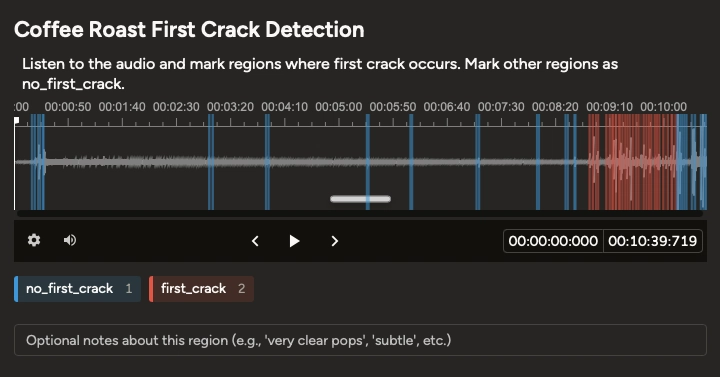
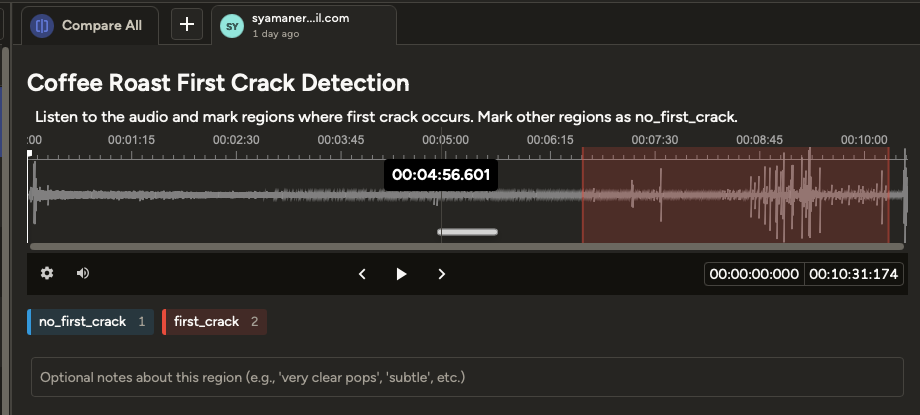
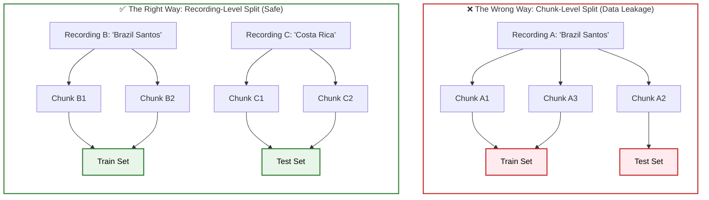

There is no public audio dataset for coffee roasting first crack detection. Not on Hugging Face, not on Kaggle, not in any paper. Before the model in [Post 1](<!-- TODO: link -->) could train a single epoch, I had to build one from scratch — recording sessions, annotating audio in Label Studio, and designing a pipeline that prevents the leakage trap that silently inflates metrics in time-series audio ML.

The result is the [first public coffee roasting audio dataset](https://huggingface.co/datasets/syamaner/coffee-first-crack-audio): **973 annotated 10-second chunks from 15 roasting sessions**, open-sourced on Hugging Face. Two engineering decisions account for the model's **100% precision and 0 false positives**: recording-level data splitting, and class-weighted training against a 20/80 imbalance.

My role was the domain judgment: what to record, how to annotate, and which constraints to enforce. Oz built the pipeline — `convert_labelstudio_export.py`, `chunk_audio.py`, and `dataset_splitter.py` — from inside the Warp terminal as part of [PR #27](https://github.com/syamaner/coffee-first-crack-detection/pull/27). This post covers those decisions.

## The Gap

When an audio ML problem has no existing dataset, there are two paths: find adjacent data and hope it transfers, or build from scratch. Coffee roasting audio is domain-specific enough that generic kitchen sounds or industrial machine noise wouldn't transfer. A roaster produces a highly distinctive acoustic signature — sustained drum rotation, background heat noise, and then the sharp transient pops of first crack that vary by bean origin and roast profile.

I scoured the ecosystem hoping to save a weekend. A [HuggingFace Datasets search for "coffee"](https://huggingface.co/datasets?search=coffee) returns sentiment analysis, quality grading, and review corpora — zero audio. Kaggle and Papers with Code were identical dead ends. Because no one had ever published annotated first crack audio, there was no baseline to build on and no pre-existing validation to benchmark against.

This makes the [dataset](https://huggingface.co/datasets/syamaner/coffee-first-crack-audio) the primary open-source contribution of this project, more than the model weights. The model is useful to anyone who wants to replicate this setup. The dataset is useful to anyone who wants to build something different — a different architecture, a multi-event detector, or a roast profiling system — without having to spend weekends in front of a roaster first.

## Recording & Annotation

The nine legacy recordings were captured with a **FIFINE 669B USB condenser microphone** — a studio cardioid permanently mounted on the roaster. It is still the production sensor on the prototype today. The six newer recordings ([S17](https://github.com/syamaner/coffee-first-crack-detection/issues/24)) were captured with an **Audio-Technica ATR2100x** — a dynamic cardioid brought in specifically for data collection sessions. Both mics record via USB into Audacity: mono, 16-bit PCM, exported at 44.1kHz. The pipeline resamples to 16kHz for the `ASTFeatureExtractor`; full-resolution WAVs are gitignored and stored on Hugging Face.

The mic difference matters for the ML model. Condensers and dynamic mics produce measurably different acoustic signatures for the same event — different sensitivity, different frequency colouring, different noise floors. With 9 condenser recordings versus 6 dynamic in the training set, the model learned first crack primarily through the FIFINE's acoustic perspective. That imbalance directly explains the **27.4-second detection delay** on the mic-2 test recording versus near-instant detection on mic-1 — which is covered in [Post 3](<!-- TODO: link -->).

Each recording is a complete roast — 8 to 12 minutes — containing exactly one first crack event. That gives a single long audio file per session with a sustained background roast signature and one first crack window somewhere inside it.

### Annotation v1: The Fragmented Approach

For the first annotation pass in Label Studio, I annotated first crack the way it sounds: as individual events. I drew a region around each pop cluster — typically 1–6 seconds per region, tightly placed around each audible burst. The Brazil recordings from October 2025 show this clearly: 18 separate FC regions across a 90-second first crack window, ranging from 1.3 seconds (`chunk_011: 455.75–457.09s`) to 5.8 seconds, with gaps of up to 9 seconds between them.



This produced baseline_v1's training data. The model trained, loss converged, and it hit 91.1% test accuracy. But it had **3 false positives** on the 45-sample test set — **87.5% precision**. At the time I attributed this to limited training data. That was wrong.

The actual problem was in how `chunk_audio.py` assigns labels. Every 10-second window gets a binary label based on whether its overlap with annotated `first_crack` regions meets a ≥50% threshold:

```python
# src/coffee_first_crack/data_prep/chunk_audio.py
def label_window(
    window_start: float,
    window_end: float,
    regions: list[dict[str, Any]],
    overlap_threshold: float = 0.5,
) -> str:
    window_duration = window_end - window_start
    overlap = compute_overlap(window_start, window_end, regions)
    if overlap >= overlap_threshold * window_duration:
        return "first_crack"
    return "no_first_crack"
```

With individual pop annotations, the very first cracking window in `brazil-3` is a 1.3-second region at 455.75s. A 10-second training window spanning 455–465s overlaps that annotation for only 1.3 seconds — **13% overlap** — and gets labeled `no_first_crack`. That window contains a real first crack pop. The same logic creates mislabeled windows at every inter-region gap throughout the recording.

### The Redesign: One Region Per Roast

The fix was conceptual, not algorithmic. First crack is not a collection of discrete events — it is a continuous acoustic period. It begins with the first audible pop and ends when cracking becomes infrequent enough to consider the phase over. The annotation should reflect the phase, not my subjective segmentation of burst clusters.

All 15 recordings were re-annotated with a single continuous region per roast, spanning from the first pop to the end of consistent cracking. The Label Studio config is deliberately minimal — one label, one region per file:

```xml
<View>
  <Audio name="audio" value="$audio" zoom="true" waveformHeight="100"/>
  <Labels name="label" toName="audio">
    <Label value="first_crack" background="#FF0000"/>
  </Labels>
</View>
```

Everything outside the annotated region is implicitly `no_first_crack`. One decision, enforced by the schema.



With one continuous region, the ≥50% threshold in `label_window` becomes deterministic. Every 10-second window inside the first crack period gets clean overlap. There are no inter-region gaps to corrupt the training signal. Baseline_v2, trained on these re-annotated labels, produced **0 false positives** on a 191-sample test set — **100% precision**.

### The Pipeline Oz Built

With the annotation strategy locked, the problem shifted from domain judgment back to code. The Label Studio export is a single JSON file covering all recordings. Before any training can start, that file needs to be parsed per-recording, each recording chunked into 10-second windows, and the chunks split into train/val/test. I specified those constraints — fixed window size, ≥50% overlap threshold, recording-level split — and Oz implemented the three scripts that handle it, working from inside the Warp terminal as part of [PR #27](https://github.com/syamaner/coffee-first-crack-detection/pull/27):

- `convert_labelstudio_export.py` — parses the Label Studio JSON into per-recording annotation files
- `chunk_audio.py` — slides the fixed window, assigns labels via the overlap logic above
- `dataset_splitter.py` — splits at the recording level to prevent leakage (next section)

Here is Oz executing the full pipeline — Label Studio conversion, chunking all 973 segments, and recording-level split — before immediately invoking the `/train-model` skill:



## Data Leakage

Audio ML has a specific leakage trap that doesn't exist in the same way for tabular or image data. A recording's acoustic fingerprint is constant throughout — the background drum hum, the extractor hood (home roasting), noise from outside (street), the room resonance, the mic's frequency response. A model trained on chunks from `roast-1` and evaluated on other chunks from `roast-1` isn't generalising. It is recognising the session.

The old prototype had exactly this problem. Its train/test split was done at the chunk level:

```
# coffee-roasting prototype — splits/
test/first_crack/roast-1-costarica-hermosa-hp-a_chunk_018.wav
train/first_crack/roast-1-costarica-hermosa-hp-a_chunk_019.wav
train/first_crack/roast-1-costarica-hermosa-hp-a_chunk_020.wav
```

`chunk_018` and `chunk_019` are consecutive windows from the same roasting session, milliseconds apart in time, sharing identical background characteristics. The prototype's 91.1% accuracy on that test set was real arithmetic on real predictions. The generalisation it implied was not — the model had acoustically seen those recordings before.



I knew this trap from prior literature search and designed the new pipeline around it from the start. `dataset_splitter.py` never touches individual chunks — it groups them by source recording first, then assigns whole recordings to a split. The grouping is derived directly from the chunk filename:

```python
# src/coffee_first_crack/data_prep/dataset_splitter.py
def extract_recording_stem(chunk_filename: str) -> str:
    """Extract the source recording stem from a chunk filename.
    
    e.g. 'roast-1-costarica-hermosa-hp-a_w0530.0.wav' -> 'roast-1-costarica-hermosa-hp-a'
    """
    stem = Path(chunk_filename).stem
    match = re.match(r"^(.+)_w\d+\.\d+$", stem)
    if match:
        return match.group(1)
    return stem
```

Once recordings are grouped, a stratified split assigns them 70/15/15 — stratified by whether each recording contains any first crack chunks, so FC-containing recordings are distributed across all three sets rather than clustering in one. The result is 15 recordings split 9/3/3, producing 587/195/191 chunks. Every chunk in the 191-sample test set comes from a recording the model had never encountered in any form during training.

## Class Imbalance

The sliding-window approach exposes the real-world distribution: **197 first_crack chunks out of 973 total — 20%**. A model predicting `no_first_crack` for every sample would score 80% accuracy without learning anything. Standard `CrossEntropyLoss` treats all samples equally, so it provides 4× more gradient signal from the majority class per epoch. On a dataset this skewed, uncorrected training converges toward majority-class bias — high accuracy, catastrophic recall on the minority class.

The old prototype masked this problem entirely. Its annotation style produced a roughly 50/50 train split (101 FC / 107 NFC), so class imbalance was never a factor. Switching to the sliding-window pipeline revealed what the distribution actually looks like at inference time.

The fix is `WeightedLossTrainer` — a two-line subclass of the HuggingFace `Trainer` that overrides `compute_loss` to use class-weighted `CrossEntropyLoss`:

```python
# src/coffee_first_crack/train.py
class WeightedLossTrainer(Trainer):
    def compute_loss(self, model, inputs, return_outputs=False, **kwargs):
        labels = inputs.pop("labels")
        outputs = model(**inputs)
        logits = outputs.logits
        weights = self.class_weights.to(logits.device)
        loss_fn = nn.CrossEntropyLoss(weight=weights)
        loss = loss_fn(logits, labels)
        return (loss, outputs) if return_outputs else loss
```

The weights are computed from the training set using inverse-frequency balancing:

```python
# src/coffee_first_crack/dataset.py
def get_class_weights(self) -> torch.Tensor:
    counts = {0: 0, 1: 0}
    for _, label in self.samples:
        counts[label] += 1
    total = len(self.samples)
    return torch.FloatTensor([
        total / (2 * counts[0]),  # no_first_crack (majority → lower weight)
        total / (2 * counts[1]),  # first_crack (minority → higher weight)
    ])
```

The minority class gets proportionally more loss contribution per sample, countering the gradient imbalance without resampling or augmentation.

This does introduce a precision/recall tradeoff. Giving the minority class more training signal raises recall — the model detects more first crack windows — but it can also push the decision boundary toward more false positives. For roasting automation, **a false positive is worse than a false negative**: misidentifying a background noise chunk as first crack could trigger an incorrect action mid-roast, while a missed window just delays detection by 10 seconds. The result reflects that priority: **100% precision, 86.1% recall, 0 false positives**. The model is conservative about committing to a detection.

## Dataset by the Numbers

The full dataset is published at [huggingface.co/datasets/syamaner/coffee-first-crack-audio](https://huggingface.co/datasets/syamaner/coffee-first-crack-audio). The source recordings, annotation JSONs, and pipeline code are in the [GitHub repository](https://github.com/syamaner/coffee-first-crack-detection).

| | |
|---|---|
| **Total chunks** | 973 (10-second WAV, 16kHz mono) |
| **first_crack** | 197 (~20%) |
| **no_first_crack** | 776 (~80%) |
| **Recordings** | 15 (9 mic-1 FIFINE 669B, 6 mic-2 ATR2100x) |
| **Bean origins** | Costa Rica Hermosa, Brazil, Brazil Santos |
| **Split (recordings)** | 9 train / 3 val / 3 test |
| **Split (chunks)** | 587 train / 195 val / 191 test |
| **Annotation tool** | Label Studio — one `first_crack` region per recording |
| **Chunking** | Fixed 10s window, ≥50% overlap threshold |
| **Split strategy** | Recording-level (prevents data leakage) |
| **License** | CC-BY-4.0 |

All four engineering decisions described in this post — the annotation redesign, fixed sliding-window chunking, recording-level splits, and class-weighted training — are encoded in the pipeline and reproducible from the published data.

[Post 3](<!-- TODO: link -->) covers the training story: two hyperparameter attempts, the oscillating loss from a learning rate that was too aggressive for 587 samples, and the diagnosis that got from **87.5% to 100% precision**.

---

## Addendum: Fixing the 27.4-Second Problem

*Written after the initial weekend, having run the prototype through a production roast season and watched exactly where it breaks.*

The 27.4-second detection delay on the mic-2 test recording is not a modelling artifact. It is reproducible. The model genuinely struggles to identify first crack on a dynamic microphone because 9 of its 15 training recordings used a condenser. The feature extractor learned first crack as it sounds through the FIFINE's acoustic lens — its sensitivity curve, its noise floor, its handling of attack transients. When the ATR2100x presents a different acoustic signature for the same physical event, the model stalls until it has accumulated enough evidence to override its prior.

Hyperparameter changes will not fix a distribution shift that lives in the training data. The fix is more mic-2 data — specifically, paired recordings that capture the same first crack event through both microphones simultaneously.

### The synchronisation problem

Two USB microphones cannot simply be opened as two independent `sounddevice` streams and assumed to stay aligned over a 10-minute roast. Each USB mic has its own internal timing crystal. Without an external synchronisation mechanism, clock drift accumulates at a rate of roughly 10–50 parts per million per second — small enough to be invisible for the first few minutes, large enough to produce a 30–300ms desync by the end of a full roast. That desync makes cross-mic annotation timestamps unreliable.

The correct solution on macOS is a CoreAudio **Aggregate Device**. Audio MIDI Setup creates a virtual multi-channel input (`RoastMics`) that combines the FIFINE and ATR2100x into one stream. **Drift Correction** on the secondary mic forces CoreAudio to continuously resample it to stay sample-locked with the primary. The result is two channels in a single array: if a first crack pop arrives at sample index N in ch 0, it arrives at sample index N in ch 1. The files are physically locked.

The consequence for annotation is significant. A 12-minute dual-mic roast requires one Label Studio annotation pass — on the FIFINE track. The ATR2100x annotation is a copy: `propagate_annotations.py` reads the `*-session.json` written by the recorder, finds the primary mic's label JSON, and writes an identical JSON for each paired mic with only `audio_file` and `duration` updated. Every chunk produced by `chunk_audio.py` from the ATR2100x recording carries ground truth that took zero extra annotation time to produce.

### What broke at the first real roast

The MCP server — the live first crack detector running during autonomous roasting — opens the FIFINE directly by device index. On macOS, this holds an exclusive CoreAudio stream claim on the raw device. When the Aggregate Device tries to include a subdevice that is already exclusively claimed, it drops the device entirely and shows "No Devices in Aggregate" with 0 input channels. The recorder cannot open `RoastMics` because the aggregate has no members.

The fix was a single addition to `find_usb_microphone()` in the coffee-roasting repo: check for a device named `RoastMics` before falling back to the raw FIFINE. If the aggregate exists, the detector opens it at ch 0, which is the FIFINE channel. CoreAudio multiplexes the hardware internally. Both the live detector and the dual-mic recorder can run in the same session.

Two batches of Copilot review on PR #48 caught additional bugs. The annotation propagation script reconstructed paired filenames from `origin` and `roast_num` — `f"mic{n}-{origin}-roast{roast_num}.wav"`. Sessions shorter than 60 seconds are saved with a `_partial` suffix. The reconstructed name would not match, and propagation would silently skip those sessions. Fix: read `mic['file']` from the session JSON directly.

The recorder had two further silent failure modes. `--mics 0 1` computes `ch_idx = m - 1 = -1`, which in NumPy reads the last column — wrong channel, no error. `--mics 1 1 2` with duplicates writes the same output file twice, the second pass overwriting the first. Both are now rejected at startup with an error message. The preflight existence check also only covered non-partial filenames; a re-run after a short failed session would overwrite prior `_partial` files silently. That was fixed to check both suffixes upfront.

These are the kind of bugs that automated review catches and live testing misses — every test session during development used `--mics 1 2` with valid, unique values.

A third review batch caught four more issues, smaller in blast radius but worth documenting. `find_session_files()` only globbed for `*-session.json`, so an annotated `_partial` session would report "No session files found" with no explanation. `recorded_at` in the session JSON used Python's `datetime.isoformat()` which produces `+00:00` rather than the `Z` suffix shown in every spec example and test fixture — a cosmetic inconsistency but one that would confuse anyone comparing output to documentation. In `spaces/app.py`, the asyncio patch suppressed any `ValueError` containing `"Invalid file descriptor"` rather than the exact string `"Invalid file descriptor: -1"`, risking suppression of different fd errors. The same patch also lacked an idempotency guard, meaning `importlib.reload()` would stack wrappers on `BaseEventLoop.__del__` indefinitely. All four fixed.

### Where this lands

The current dataset is 15 recordings, 973 chunks, 9:6 condenser-to-dynamic. Two Panama Hortigal Estate roasts have been captured with the new dual-mic setup — 12.8 and 15.1 minutes of paired audio, sample-locked, pending Label Studio annotation. Each annotated dual-mic roast adds one mic-1 and one mic-2 recording at 1:1 ratio, closing the imbalance that produced the 27.4-second delay. The prototype detected first crack correctly on both roasts without any model changes.

The recorder currently buffers all audio in RAM and writes on stop. This is fine for the target hardware but loses data on a hard kill (SIGTERM). A follow-up story (S21) will replace the in-memory accumulation with a producer-consumer queue writing continuously to disk, plus an optional `--verify` flag that runs automated peak, balance, and sample-lock checks after each session.

The infrastructure to grow the dataset is now the same effort as roasting the coffee.

---

## References

#### 1. Data Leakage in Time-Series & Audio ML

The "chunk-level vs. recording-level" split is one of the most common pitfalls in time-series ML. Here is the literature that backs up this architectural decisions

- **[Time Series Nested Cross-Validation (Scikit-Learn)](https://scikit-learn.org/stable/modules/cross_validation.html#cross-validation-of-time-series-data)**

> Time series data is characterized by the correlation between observations that are near in time (autocorrelation). However, classical cross-validation techniques such as KFold and ShuffleSplit assume the samples are independent and identically distributed, and would result in unreasonable correlation between training and testing instances (yielding poor estimates of generalization error) on time series data.

- **[Data Leakage in Machine Learning (Kaggle Guide)](https://www.kaggle.com/code/alexisbcook/data-leakage)**

> After all, you incorporated data from the validation or test data into how you make predictions, so the may do well on that particular data even if it can't generalize to new data. This problem becomes even more subtle (and more dangerous) when you do more complex feature engineering.


#### 2. Handling Class Imbalance (The PyTorch & HF Way)

The `WeightedLossTrainer` approach is the mathematically correct way to handle a 20/80 split without synthetic augmentation

- **[PyTorch `nn.CrossEntropyLoss` Documentation](https://pytorch.org/docs/stable/generated/torch.nn.CrossEntropyLoss.html)**

> It is useful when training a classification problem with C classes. If provided, the optional argument weight should be a 1D Tensor assigning weight to each of the classes. This is particularly useful when you have an unbalanced training set.

- **[Hugging Face Trainer Customization Guide](https://huggingface.co/docs/transformers/main_classes/trainer#subclassing-trainer)** 

> Subclass Trainer methods to change training behavior without rewriting the entire loop. Subclassing modifies the training loop, for example the forward pass or loss computation.

### 3. Audio Annotation & Label Studio

- **[Label Studio Audio Annotation Guide](https://labelstud.io/guide/audio)**
- **[Google's AudioSet Ontology](https://research.google.com/audioset/ontology/index.html)**

### 4. Hardware Realities: Condenser vs. Dynamic Mics

The 27.4-second delay on the test set was caused by switching from the FIFINE (Condenser) to the Audio-Technica (Dynamic). 

- **[Dynamic vs. Condenser Mics (Shure Insights)](https://www.shure.com/en-US/insights/dynamic-vs-condenser-mics-toms)** 

While framed around recording drum hits, the guide explains why dynamic mics have lower sensitivity and a "less present attack" compared to condensers—which directly translates to the model missing the earliest, quietest pops of coffee roasting.


### 5. Hugging Face Audio Ecosystem
- **[Hugging Face Audio Course (Chapter 5: Building an Audio Dataset)](https://huggingface.co/learn/audio-course/chapter5/introduction)**
