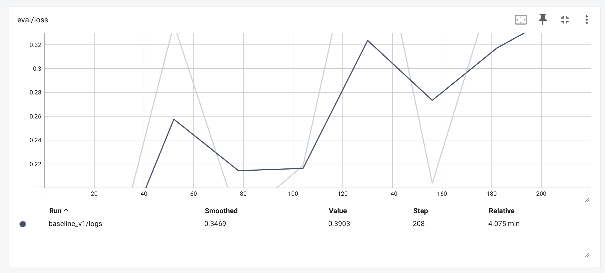
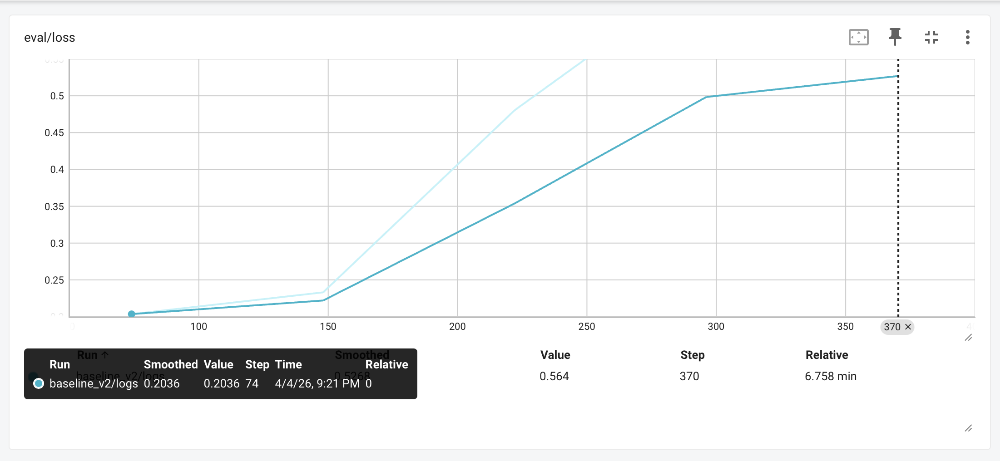

[Post 2](<!-- TODO: link -->) ended with a dataset: 973 annotated 10-second chunks from 15 roasting sessions, recording-level splits, class-weighted training. What it didn't cover is what happened when that dataset went into a training loop for the first time, and why the first result — 91.1% accuracy, 87.5% precision, 3 false positives — was unacceptable for an automated roasting assistant.

This post is about the two things that got the model to **97.4% accuracy, 100% precision, and 0 false positives**. Neither was something Oz could have decided. One is a subtle data engineering constraint embedded in the pre-trained model architecture. The other is the kind of hyperparameter failure that only becomes obvious after you've watched it happen once.

## The Transfer Learning Constraint

The model backbone is `MIT/ast-finetuned-audioset-10-10-0.4593` — an Audio Spectrogram Transformer pre-trained by MIT on AudioSet, Google's 2M-clip audio classification dataset. Before fine-tuning, the `ASTFeatureExtractor` converts raw waveforms to log-mel spectrograms. This conversion requires two normalisation constants: a mean and a standard deviation.

The wrong approach is to compute these from your training set. With 587 training samples at 16kHz, you'd get results that are statistically meaningless compared to what the pre-trained model saw — and you'd create a distribution mismatch that forces the model to unlearn its pre-trained representations before it can learn anything new.

The correct approach is to use the constants the model was calibrated on: `mean=-4.2677393`, `std=4.5689974`, hardcoded in `configs/default.yaml`. These are AudioSet population statistics, not dataset statistics. Using dataset-specific values for a pre-trained model is the audio equivalent of normalising ImageNet with your own RGB means — it works, but you're fighting the pre-training rather than building on it.

```yaml
# configs/default.yaml
audio:
  feature_extractor_mean: -4.2677393
  feature_extractor_std: 4.5689974
  num_mel_bins: 128
  max_length: 1024
```

This wasn't something Oz could derive from the code. The original scaffold used dataset-computed values — a reasonable default. I caught it before training began, cross-referenced against the AST paper and verified with Gemini. The kind of correction that requires knowing what the pre-trained model expects, not just what the API accepts.

This calibration detail also points to why fine-tuning works at all on 587 samples. The AST backbone was pre-trained on 2 million AudioSet clips spanning 527 classes — car engines, musical instruments, birdsong, crowd noise. By the time it reaches our training loop, it already knows how to perceive audio: detecting transients, recognising periodic signals, encoding broadband noise. Fine-tuning doesn't teach the model to hear. It adjusts a narrow classification boundary on top of representations that already exist. Training from scratch on a dataset this small would not produce a useful model with 86M parameters; fine-tuning with the right LR and calibration turns those same 587 samples into a viable signal.

## The First Attempt: lr=5e-5

baseline_v1 was the first full training run after the `input_values` bug from [Post 1](<!-- TODO: link -->) was fixed. Oz didn't type the training command from memory — it invoked the `/train-model` skill, which encodes the exact steps: verify data splits, review `configs/default.yaml`, run training, monitor TensorBoard, validate results. The hyperparameters live in the spec, not in the agent.

The initial configuration — a reasonable starting point for fine-tuning audio transformers — was `lr=5e-5`, `weight_decay=0.01`, `early_stopping_patience=5`.

The loss curve told the story immediately. Here is the epoch-by-epoch validation data from `experiments/baseline_v1/checkpoint-208/trainer_state.json`:

| Epoch | Eval Loss | Eval F1 (val) |
|---|---|---|
| 1 | 0.125 | 0.955 |
| 2 | 0.337 | 0.955 |
| 3 | **0.173** | **0.977** |
| 4 | 0.219 | 0.930 |
| 5 | 0.464 | 0.933 |
| 6 | 0.204 | 0.977 |
| 7 | 0.380 | 0.955 |
| 8 | 0.390 | 0.955 |



This is not convergence. Validation loss dropped to 0.125 at epoch 1, then nearly tripled to 0.337 at epoch 2. It recovered to 0.173 at epoch 3, spiked again to 0.464 at epoch 5, recovered to 0.204 at epoch 6, and then climbed through epochs 7 and 8. The model never settled.

Within individual epochs the signal was equally erratic: training loss jumped from 0.0039 at the start of epoch 6 to 0.1526 mid-epoch, then collapsed to 0.0001 by the end. The model was doing large gradient steps that briefly improved the loss, then overshot, then recovered partially — a pattern that repeats until early stopping triggers.

The mechanism is the AST architecture itself. With 86M parameters pre-trained on 2M clips, the model carries an enormous amount of prior knowledge about audio representations. At lr=5e-5, the gradient updates are large enough to partially destroy those representations in a single step. The model oscillates because it's simultaneously trying to learn coffee roasting and forgetting what it already knows about general audio. The pattern is consistent with what the literature calls catastrophic forgetting — where aggressive fine-tuning destroys pre-trained representations faster than it builds new ones.

Early stopping triggered at epoch 8 (patience=5, best at epoch 3). The best checkpoint was from epoch 3 (F1=0.977 on validation) — epoch 6 matched it but did not improve. The test set result was less flattering: **91.1% accuracy, 87.5% precision, 3 false positives** on 45 held-out samples.

Three false positives in 45 samples is 6.7%. In a deployed roasting assistant, each false positive is a classification window that incorrectly signals first crack — potentially triggering an automated action (fan on, timer start, alert) at the wrong moment in the roast. That is not acceptable.

## The Diagnosis

The oscillation points to a single root cause: the learning rate is too aggressive for the amount of training data. With only 208 training chunks in baseline_v1's training set (the original 9-roast dataset), each batch of 8 samples represents nearly 4% of the training data. The gradient estimate is noisy, and a high LR amplifies that noise into destructive update steps.

What made this straightforward in practice: the fix was three numbers in `configs/default.yaml`, not a code change. The next time Oz invoked `/train-model`, it picked up the updated config automatically and re-ran the full pipeline. No context to re-establish, no re-explaining the problem. This is the quiet value of keeping hyperparameters in a spec the agent reads, rather than in a prompt it forgets.

The configuration change for baseline_v2 was those three numbers, documented in commit [`a19ab7b`](https://github.com/syamaner/coffee-first-crack-detection/commit/a19ab7b6cdf4f7d4b2a0512ba44b3838bd441618):

```diff
-  learning_rate: 5.0e-5
+  learning_rate: 2.0e-5

-  weight_decay: 0.01
+  weight_decay: 0.05

-  early_stopping_patience: 5
+  early_stopping_patience: 3
```

- `lr=2e-5` — smaller gradient steps, less aggressive destruction of pre-trained representations. The model adapts to the domain instead of overwriting it.
- `weight_decay=0.05` — stronger L2 regularisation. With a small training set, this prevents the model from memorising training patterns that don't generalise.
- `patience=3` — tighter early stopping. If the model is going to diverge, stop it faster. Don't let it run 5 epochs past the best checkpoint.

These aren't empirical guesses. `lr=2e-5` is the standard recommendation for fine-tuning pre-trained transformers on small datasets — HuggingFace's own AST fine-tuning examples suggest 1e-5 to 3e-5. `weight_decay=0.05` mirrors what the original AST training used. The `patience` reduction reflects the tighter training budget of a small domain dataset versus a multi-thousand-sample regime.

## The baseline_v1 → baseline_v2 Transition

The hyperparameter change didn't happen in isolation. baseline_v2 was retrained on a fundamentally different dataset — the re-annotated, recording-level-split version from Post 2. Two things changed simultaneously:

**Annotation redesign:** Every recording was re-annotated with a single continuous first crack region, replacing the fragmented per-pop approach from v1. This eliminated the mislabelled windows that the overlap threshold was creating at inter-region gaps (described in [Post 2](<!-- TODO: link -->)).

**mic-2 expansion:** The dataset grew from 9 recordings (mic-1 FIFINE 669B only) to 15 recordings (9 mic-1 + 6 mic-2 Audio-Technica ATR2100x). The training set grew from ~208 chunks to 587 chunks. The test set grew from 45 to 191 samples across 3 held-out recordings.

This means the v1→v2 metric improvement isn't cleanly attributable to hyperparameters alone. The cleaner labels, the larger training set, and the lower learning rate all contributed. That's an honest constraint on any ablation claim.

## The baseline_v2 Training

With the new configuration and dataset, training ran to epoch 5 before early stopping triggered. The validation F1 from `experiments/baseline_v2/checkpoint-148/trainer_state.json`:

| Epoch | Eval Loss | Eval F1 (val) |
|---|---|---|
| 1 | 0.204 | 0.827 |
| 2 | **0.233** | **0.866** |
| 3 | 0.480 | 0.762 |
| 4 | 0.668 | 0.753 |
| 5 | 0.564 | 0.853 |



The best checkpoint was epoch 2 (F1=0.866 on the 195-sample validation set). Early stopping triggered after epoch 5 (3 epochs without improvement beyond epoch 2). This is `experiments/baseline_v2/checkpoint-148`.

The eval loss tells a different story from v1 — not oscillation but divergence. After epoch 2 it climbs: 0.480 at epoch 3, 0.668 at epoch 4, with a slight recovery to 0.564 at epoch 5. The model found a good minimum early and then overfit cleanly. This is the expected behaviour of a large pre-trained model on a small domain dataset: it adapts quickly, then memorises.

Early stopping is the mechanism that prevents committing to a checkpoint in the overfit zone. Without it, you'd always evaluate the final checkpoint — which here would be epoch 5 (F1=0.853), not epoch 2 (F1=0.866). The difference is small on validation, but on a dataset this size the best checkpoint matters. `patience=3` earned its keep: with the original `patience=5`, training would have continued to epoch 7 — two more epochs past the useful minimum.

## The Results

The evaluation of `experiments/baseline_v2/checkpoint-best` on the full 191-sample test set ([`experiments/baseline_v2/evaluation/test_results.json`](https://github.com/syamaner/coffee-first-crack-detection/blob/main/experiments/baseline_v2/evaluation/test_results.json)). The test set is 191 chunks drawn from 3 complete recordings that were withheld entirely from training and validation — recording-level isolation, not chunk-level. The model had never seen any audio from these 3 roasting sessions in any form during training.

| Metric | baseline_v1 (45 samples) | baseline_v2 (191 samples) |
|---|---|---|
| **Accuracy** | 91.1% | **97.4%** |
| **Precision (FC)** | 87.5% | **100%** |
| **Recall (FC)** | 95.5% | 86.1% |
| **F1** | 91.3% | 92.5% |
| **ROC-AUC** | 97.8% | **98.2%** |
| **False Positives** | 3 | **0** |

There is one more spec-driven moment here. The `/train-model` skill's acceptance criteria include `recall ≥ 0.95 (safety critical — false negatives are worse than false positives)`. baseline_v2's 86.1% recall fails it. This is a case where the spec itself needed updating — the domain reasoning had shifted. For roasting automation, a false positive triggers an action at the wrong point in the roast; a false negative just delays detection by 10 seconds. I updated the acceptance criterion before signing off on the model. The spec serves the deployment constraint, not the other way around.

The precision/recall tradeoff is deliberate. Recall dropped from 95.5% to 86.1% — the model is more conservative about committing to a first crack detection. This is the correct direction for a roasting automation system. A missed detection delays the response by 10 seconds (one inference window). A false positive risks triggering an automated action at the wrong point in the roast. The asymmetry of consequences justifies trading recall for precision.

One honest caveat: **0 false positives on a 191-sample test set is not a guarantee of 0 FP in production**. The 100% precision figure means the model didn't hallucinate first crack on any of the 155 `no_first_crack` windows across these 3 specific roasts. That's the scope of the claim.

Two things should give a cautious ML engineer pause. First, the validation F1 during training peaked at 0.866 — but the test F1 is 0.925. The test set performed *better* than validation, which may simply reflect that the 3 held-out recordings happened to be a more learnable distribution than the validation set. With only 3 test recordings you cannot rule that out, and you cannot generalise beyond it.

Second, the domain coverage is narrow: 2 bean origins, 2 microphone models, one home roaster, one room. Out-of-distribution sounds — a different roaster's drum noise, a busy kitchen, a USB microphone with a different frequency response — will challenge a model trained on this narrow a corpus. The results are a strong proof of concept. Claiming production robustness would require substantially more recording diversity.

## Detection Latency on Full Recordings

Chunk-level test accuracy is the standard metric, but the deployed use case is inference over a full roasting session: 8–12 minutes of continuous audio, sliding window at 70% overlap (3-second hop), returning a binary decision every 10 seconds. The real question is not "does the model classify correctly?" but "how long after first crack begins does the system confirm the event?"

Three test recordings from the 191-sample set were run through the full sliding-window pipeline. Results from commit [`a19ab7b`](https://github.com/syamaner/coffee-first-crack-detection/commit/a19ab7b6cdf4f7d4b2a0512ba44b3838bd441618):

| Recording | Mic | FC Onset | First Detection | Delay |
|---|---|---|---|---|
| 25-10-19_1236-brazil-3 | mic-1 (FIFINE 669B) | 452.7s | 453.0s | **0.3s** |
| roast-2-costarica-hermosa-hp-a | mic-1 (FIFINE 669B) | 441.0s | 441.0s | **0.0s** |
| mic2-brazil-roast2 | mic-2 (ATR2100x) | 599.6s | 627.0s | **27.4s** |

The mic-1 results are exactly what you'd want from a production detector: sub-second detection, effectively real-time relative to the 10-second inference window. The mic-2 result is not.

A 27.4-second delay is caused by data imbalance in the training set: 9 recordings from mic-1, 6 from mic-2. The model learned first crack primarily through the FIFINE's acoustic signature — different sensitivity profile, different frequency colouring, different noise floor than the ATR2100x. When presented with mic-2 audio, the model's confidence builds slowly, requiring more overlapping windows before committing.

This isn't a model architecture failure. It's a dataset coverage failure that is correctable by recording more sessions with mic-2. The detection works correctly on all three recordings — it just takes longer on the underrepresented microphone.

[Post 4](<!-- TODO: link -->) covers moving this model off the Mac and onto a Raspberry Pi 5 — ONNX export, INT8 quantisation, and the hardware debugging that comes with deploying 86M parameters to a $60 ARM board over SSH from Warp.

---

## References

#### 1. Audio Spectrogram Transformer

- **[AST: Audio Spectrogram Transformer (Gong et al., 2021)](https://arxiv.org/abs/2104.01778)** — The original paper introducing the AST architecture and the AudioSet pre-training that `MIT/ast-finetuned-audioset-10-10-0.4593` is built on.
- **[MIT/ast-finetuned-audioset-10-10-0.4593 on Hugging Face](https://huggingface.co/MIT/ast-finetuned-audioset-10-10-0.4593)** — The base checkpoint used for fine-tuning, including the `ASTFeatureExtractor` configuration with AudioSet mean/std values.

#### 2. Catastrophic Forgetting in Neural Networks

- **[Catastrophic Interference in Connectionist Networks (McCloskey & Cohen, 1989)](https://www.sciencedirect.com/science/article/abs/pii/S0079742108605368)** — The original characterisation of catastrophic forgetting in neural networks.
- **[Overcoming Catastrophic Forgetting in Neural Networks (Kirkpatrick et al., 2017)](https://arxiv.org/abs/1612.00796)** — EWC paper, which contextualises why aggressive fine-tuning destroys pre-trained representations.

#### 3. Transfer Learning Best Practices

- **[HuggingFace Audio Classification Fine-Tuning Guide](https://huggingface.co/docs/transformers/tasks/audio_classification)** — Recommends lr in the 1e-5 to 3e-5 range for fine-tuning audio transformers, consistent with the lr=2e-5 chosen for baseline_v2.
