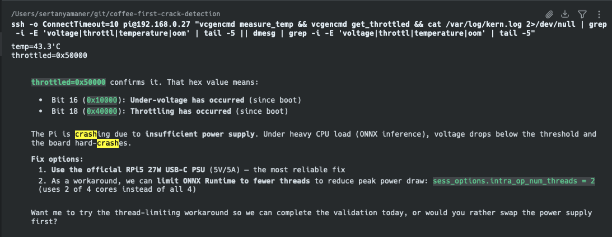
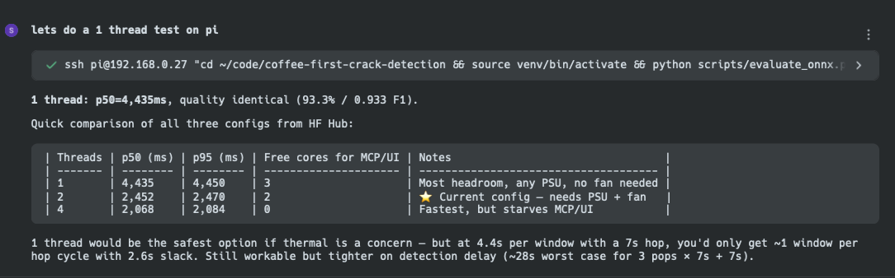

[Post 3](<!-- TODO: link -->) ended with three numbers: 97.4% test accuracy, 100% precision, 0 false positives. All of it measured on a MacBook. This post covers taking that model to the hardware it is actually meant to run on — a Raspberry Pi 5, listening to a home roaster over a USB microphone during a live roast.

The naive path works. Export the PyTorch checkpoint to ONNX FP32, copy the 345MB file across to the Pi, run inference. The first benchmark returned **9.4 seconds per 10-second audio window**. Not a misconfiguration. That is what an 86M parameter transformer costs on a single ARM Cortex-A76 core at full floating-point precision.

Getting to **2.09 seconds** (4 threads, active cooler) required INT8 dynamic quantisation via `onnxruntime.quantization`, explicit thread-limiting to prevent under-voltage crashes, a PSU swap from a standard USB-C charger to the official Raspberry Pi 27W supply, and a debugging session from inside Warp where Oz ran `vcgencmd get_throttled` over SSH and the hex flag came back `0x50000`.

## What We're Deploying

The model is an Audio Spectrogram Transformer fine-tuned for binary classification: `first_crack` vs `no_first_crack` on 10-second audio windows resampled to 16kHz mono. [Post 2](<!-- TODO: link -->) covers the dataset — 973 annotated chunks from 15 roasting sessions, recording-level splits to prevent data leakage, class-weighted training against a 20/80 imbalance. [Post 3](<!-- TODO: link -->) covers the training — two hyperparameter attempts, the oscillating loss from a learning rate too aggressive for 587 samples, and the annotation redesign that moved precision from 87.5% to 100%.

The numbers relevant to this post:

- **86M parameters** — fine-tuned from `MIT/ast-finetuned-audioset-10-10-0.4593`, pre-trained on 2M AudioSet clips
- **97.4% test accuracy / 100% precision** on baseline_v2 (191-sample test set, recording-level isolation)
- **ONNX INT8 on Mac:** 96.86% accuracy, 1 additional FP — the full quality cost of INT8 quantisation on the same test set
- Model and ONNX variants published at [huggingface.co/syamaner/coffee-first-crack-detection](https://huggingface.co/syamaner/coffee-first-crack-detection)

## The SSH Workflow

The Pi validation for [PR #23](https://github.com/syamaner/coffee-first-crack-detection/pull/23) followed a specific division of labour. The ONNX models were exported on the Mac and synced across to the Pi. Oz then SSH'd into the device from within the Warp terminal and drove the benchmark and evaluation scripts directly. My role was to observe the results and make decisions about hardware configuration; the agent's role was to type.

The value of this only becomes clear when you mentally play out the alternative. With a browser-based assistant, the loop is: copy the terminal output → paste into chat → read the suggestion → switch back → run the command. With Oz in Warp, the SSH session, the benchmark run, and the result analysis are all one continuous thread. The `evaluate_onnx.py` run would finish, the latency numbers appear, and the next command is already being composed before the output has finished scrolling.

Two scripts drove everything on the Pi:

- `scripts/evaluate_onnx.py` — runs the test set through the ONNX model and returns accuracy, F1, confusion matrix, and per-sample latency. Designed with no PyTorch inference dependency so it runs on the Pi without a GPU torch install.
- `scripts/benchmark_onnx_pi.py` — 30 timed runs after 5 warmup runs, using dummy audio to isolate inference latency from file I/O variance.

One non-obvious setup requirement: even though inference runs entirely through ONNX Runtime, PyTorch CPU is still needed on the Pi for `ASTFeatureExtractor`'s mel filterbank computation. The install is split deliberately — `requirements-pi.txt` handles the ONNX and audio dependencies, then torch CPU is added separately:

```bash
pip install -r requirements-pi.txt
pip install torch --index-url https://download.pytorch.org/whl/cpu
```

`torchaudio` and `optimum` are explicitly excluded from the Pi install. ONNX Runtime handles everything from the filterbank output onward.

Here is the evaluation session — Oz running `evaluate_onnx.py` over SSH on the Pi, 4 threads, reading the latency numbers as they arrive:



PR #23 accumulated **36 Copilot comments across 6 review rounds** — the most reviewed PR in the project. The pattern was consistent with the rest of the series: type annotations, missing error handlers, edge-case validation. Copilot flagged a missing `FileNotFoundError` when the ONNX path doesn't exist and a missing explicit `n_samples` type on the evaluation report. It did not flag the benchmark script's `<500ms` target line — that constraint is Mac-centric, and on the Pi it will always print `⚠️ FAIL` regardless of whether the latency is acceptable for the actual use case. The sliding inference window is 10 seconds with a 3-second hop; a 2-second inference time is perfectly adequate for real-time roasting detection, regardless of what the script reports.

## ONNX Export

The trained checkpoint is a standard Hugging Face `save_pretrained` directory: model weights, config, and the `ASTFeatureExtractor` preprocessor config. Getting it to the Pi is a two-step process — export the PyTorch graph to a static FP32 ONNX graph, then compress the weights to INT8. Oz executed both steps by invoking the `/export-onnx` skill shown in [Post 1](<!-- TODO: link -->), which runs export, quantisation, and a local benchmark in sequence before marking the step complete.

Step one uses Hugging Face Optimum:

```python
# src/coffee_first_crack/export_onnx.py
from optimum.onnxruntime import ORTModelForAudioClassification

ort_model = ORTModelForAudioClassification.from_pretrained(
    model_dir,
    export=True,
)
ort_model.save_pretrained(str(fp32_dir))
```

`export=True` triggers ONNX tracing at load time. The result is `exports/onnx/fp32/model.onnx` at **345MB**. That file ran at 9.4 seconds per window on the Pi at 1 thread — confirmed by `results/pi5_fp32_eval.json`. Usable for offline batch processing; not for a live roasting session.

Step two uses `onnxruntime.quantization.quantize_dynamic`:

```python
# src/coffee_first_crack/export_onnx.py
from onnxruntime.quantization import QuantType, quantize_dynamic

quantize_dynamic(
    model_input=str(fp32_path),
    model_output=str(int8_path),
    weight_type=QuantType.QInt8,
)
```

Dynamic quantisation converts weights to INT8 at export time; activations remain in FP32 at runtime. This is intentionally chosen over static quantisation, which would require a calibration dataset to quantise activations too. The simpler dynamic approach carries a smaller quality penalty — and the result is **architecture-portable**: the same `model_quantized.onnx` benchmarked at 636ms on Apple Silicon runs unchanged on the Pi's ARM Cortex-A76. No recompilation, no platform-specific pass.

The output from one export run:

- `exports/onnx/fp32/model.onnx` — **345MB**, FP32 precision
- `exports/onnx/int8/model_quantized.onnx` — **89.9MB**, INT8 weights

**3.84× size reduction.** The full quality and latency comparison across platforms is in the next section.

One design detail worth noting: the feature extractor config is saved into every variant directory independently. Each subdirectory is self-contained — you can copy just `exports/onnx/int8/` to the Pi and run inference without the full repo structure or a parent-level config lookup.

There is a second deployment path that avoids any manual copy. The ONNX variants were pushed to HF Hub alongside the PyTorch checkpoint — `syamaner/coffee-first-crack-detection` includes an `onnx/int8/` subfolder. The production inference module, `inference_onnx.py`, is HF Hub-first by design: `_DEFAULT_REPO_ID = "syamaner/coffee-first-crack-detection"` and `_DEFAULT_SUBFOLDER = "onnx/int8"` are the hardcoded defaults. At startup it calls `hf_hub_download` and caches locally. A Pi with only `requirements-pi.txt` + torch CPU installed can pull and run the model without any repo cloning or file transfer. The PR #23 validation used local exports synced over via `scp` because the test split data was also local — but a fresh production deployment pulls everything from the Hub.

## The Platform Numbers

The v2 Pi5 evaluation (`results/v2_pi5_int8_4t_eval.json`) settled the portability question directly: does INT8 dynamic quantisation produce different accuracy on ARM64 versus Apple Silicon? The answer is no. The Pi5 INT8 model at 4 threads, run against the same 191-sample v2 test set, returns **96.86% accuracy, 96.9% precision, 1 false positive** — an identical confusion matrix to the Mac INT8 result: `[[154, 1], [5, 31]]`.

| Model | Platform | Test set | Accuracy | Precision (FC) | FP | Latency p50 |
|---|---|---|---|---|---|---|
| PyTorch baseline_v2 | Mac (MPS) | v2 — 191 samples | 97.4% | 100% | 0 | — |
| ONNX INT8 | Mac | v2 — 191 samples | 96.86% | 96.9% | 1 | 636ms |
| ONNX INT8 | Pi5, 4 threads | v2 — 191 samples | **96.86%** | 96.9% | 1 | 2,092ms |
| ONNX FP32 | Pi5, 1 thread | v1 — 45 samples† | 93.3% | 91.3% | 2 | 9,412ms |
| ONNX INT8 | Pi5, 2 threads | v1 — 45 samples† | 93.3% | 91.3% | 2 | 2,436ms |

†v1 test set (6 roasts, original annotations). v2 2-thread evaluation pending.

The total INT8 quantisation cost — measured against the v2 baseline on the same test set — is **0.54% accuracy and 1 additional false positive**. That cost is identical on Mac and Pi5. The identical confusion matrix confirms the ONNX artefact is fully portable — same weights, same predictions, regardless of whether the host is Apple Silicon or ARM Cortex-A76.

The v1 rows exist for the FP32 vs INT8 latency story: 9.4 seconds at full FP32 precision, 2.4 seconds at 2 threads INT8, 2.07 seconds at 4 threads. The accuracy figures in those rows reflect the older, smaller test set and should not be read as platform quality numbers.

## Threshold Sweep

The default classification threshold is 0.5 — any window where the model outputs `P(first_crack) ≥ 0.5` is flagged. For an isolated classifier, that default is fine. For a roasting assistant, the consequences are asymmetric.

A false negative means the system waits one more 10-second window before detecting first crack. A false positive — incorrectly flagging background noise or a drum knock as first crack — could trigger an automated action (timer, fan relay, alert) at the wrong moment in the roast. The tradeoff is not symmetric, and the threshold should reflect that.

The sweep ran from 0.50 to 0.95 on the Pi5 INT8 model (`results/pi5_threshold_sweep.json`, v1 test set):

| Threshold | Precision | Recall (FC) | F1 | FP | FN |
|---|---|---|---|---|---|
| 0.50 | 91.3% | 95.5% | 93.3% | 2 | 1 |
| 0.75 – 0.90 | 95.2% | 90.9% | 93.0% | 1 | 2 |
| **0.95** | **100%** | 77.3% | 87.2% | **0** | 5 |

The numbers between 0.50 and 0.65 are identical — the model's output probabilities are far from the decision boundary in most cases. At 0.75, one FP is eliminated; the remaining FP (a `no_first_crack` chunk scored at 0.941) survives all the way to 0.90. Only at 0.95 does it drop out, reducing FP to zero — at the cost of recall dropping to 77.3% (5 additional missed windows).

**The deployed Pi profile does not use 0.95.** It uses 0.90, paired with a pop-confirmation layer. The logic is in `configs/default.yaml`:

```yaml
# configs/default.yaml
pi_inference:
  window_size: 10.0
  overlap: 0.3           # 30% → 7s hop — comfortable margin for 2-thread latency
  threshold: 0.90        # precision=0.952, recall=0.909, F1=0.930
  min_pops: 3            # 3 positive windows required within the confirmation window
  confirmation_window: 30.0  # seconds
  onnx_threads: 2        # leaves 2 cores free for MCP server + agent UI
```

A single window scoring above 0.90 does not trigger the detector. Three positive windows within a 30-second span must agree. An isolated false positive — a lone high-confidence window from background noise — cannot survive the confirmation requirement. The only scenario where a FP triggers the system is three separate audio windows, 7 seconds apart, all independently scoring above 0.90. In practice that doesn't happen; the 0.941 outlier in the test set appears once, in one chunk, not in three consecutive windows of a real roasting session.

Two further notes on the Pi profile. First, the overlap drops from 70% (default, 3-second hop) to 30% (7-second hop). With 2-thread inference at 2.45 seconds per window, a 3-second hop would leave almost no idle time and risk falling behind the audio stream. The wider hop provides 4.5 seconds of headroom per cycle. Second, the thread count is 2 — not 4 — because the Pi runs more than just the detector. The MCP server and agent UI share the same device; limiting ONNX to 2 cores prevents inference from starving the rest of the stack.

## The Hardware War Story

The first sustained inference run on the Pi used an Apple 96W USB-C charger. It was what was on the desk. The benchmark ran at 1 thread without issue. At 2 threads, the Pi5 crashed mid-run.

Oz was already in the SSH session. The next command was `vcgencmd get_throttled`:

```
$ vcgencmd get_throttled
throttled=0x50000
```

`0x50000` sets bits 16 and 18 in the throttle register — **under-voltage has been detected** and **throttling has occurred**. The Pi5 was drawing more current than the charger could supply and the firmware was cutting clock speeds to compensate. When the deficit is severe enough, the board halts entirely.

The Apple 96W charger negotiates 5V at 3A on its USB-C output — 15 watts. The Raspberry Pi 5 under sustained 2+ thread inference draws up to 5V/5A — 27 watts. This is not a quirk; it is in the RPi5 hardware specification. The 5V/5A USB Power Delivery profile the Pi requires is simply not what most laptop chargers — including the Apple 96W — negotiate. The naming is misleading: "96W" refers to the high-voltage MacBook profile, not the 5V rail.

Oz handled the workaround immediately: dropped `onnx_threads` to 1 and re-ran. Single-thread inference stayed within the 15W budget and the benchmark completed. But 1-thread inference at 9.4 seconds per window is not a deployment target. The fix required hardware, not configuration.

Gemini was brought in to cross-reference the RPi5 throttle register documentation and the official PSU specification. The human made the call: the official Raspberry Pi 27W USB-C Power Supply (5V/5A) was the required fix, not a config change.

Here is the SSH debugging session — Oz reading `vcgencmd get_throttled`, diagnosing the `0x50000` flag, and adjusting threads as an interim workaround while the hardware decision was made:



**After the PSU swap**, 4-thread inference ran without crashes. But a second flag appeared under sustained load:

```
$ vcgencmd get_throttled
throttled=0xe0000
```




`0xe0000` sets bits 17, 18, and 19 — **ARM frequency capped**, **throttling has occurred**, **soft temperature limit active**. The CPU core temperature hit 77°C under continuous inference. The Pi5 has no heatsink by default; sustained transformer inference is a thermal stress test the passive design cannot pass.

The official Raspberry Pi Active Cooler brought operating temperature to 45°C under sustained 4-thread inference — a 32°C reduction. At 45°C, `vcgencmd get_throttled` returns `0x0`. Stable.

The final hardware requirements from that debugging session are encoded in `AGENTS.md`:

```markdown
### RPi5 Hardware Requirements
- **PSU**: Official RPi5 27W (5V/5A) USB-C — standard chargers (5V/3A incl. Apple 96W) cause under-voltage crashes
- **Cooling**: Active cooler mandatory — sustained inference hits 77°C+ without it
- **Threads**: Default 2 via `--threads` flag; 4 threads needs 27W PSU + active cooler
```

The context-switching cost of this entire debugging session was near zero. Oz, the SSH session, the `vcgencmd` output, and the subsequent `AGENTS.md` update all lived inside one Warp terminal. The usual loop — crash → screenshot → paste into a browser tab → wait for a reply → SSH back in — did not happen.

## The Verdict

The production Pi deployment runs `inference_onnx.py --profile pi_inference`: 2 ONNX threads, 30% overlap (7-second hop), threshold 0.90, `min_pops: 3` confirmation. Under those parameters — 27W PSU, active cooler — per-window latency is **2.45 seconds p50**. That leaves 4.5 seconds of idle time between inference calls at the 7-second hop, which is enough headroom for the MCP server and agent UI sharing the same board.

For this use case, that is sufficient. First crack is not a millisecond-precision event. It is a sustained acoustic phase lasting 60 to 90 seconds. A detector that confirms within 30 seconds of onset — three positive windows at 7-second intervals — fits the timing of a real roast. The 2.07-second 4-thread result is the performance ceiling with optimal hardware; 2.45 seconds at 2 threads is the stable production target.

The harder observation is what these numbers say about transformers at the edge more generally. An 86M parameter model that takes 9.4 seconds at FP32 on a $60 ARM board is not a general-purpose edge architecture. It works here because the inference cadence is slow and the event it detects lasts long enough to be caught across multiple windows. Deploy the same model against a task requiring sub-second response and you would need a much smaller architecture or dedicated inference hardware. INT8 quantisation helped — 3.84× size reduction, 4.5× latency improvement over FP32 — but it does not turn a large transformer into a microcontroller-class model.

[Post 5](<!-- TODO: link -->) covers the other half of making the model usable: getting it in front of people who are not running SSH sessions into a Raspberry Pi. Publishing the model card and dataset card, building a Gradio Space that works inside a container, and the four platform bugs — including an SSR/asyncio crash on Python 3.13 — each diagnosed by pasting HF Space logs to Oz and getting fixes back in seconds.

---

## Links

**Project:**
- [GitHub Repository](https://github.com/syamaner/coffee-first-crack-detection)
- [Hugging Face Model](https://huggingface.co/syamaner/coffee-first-crack-detection)
- [Hugging Face Dataset](https://huggingface.co/datasets/syamaner/coffee-first-crack-audio)
- [Live Gradio Space](https://huggingface.co/spaces/syamaner/coffee-first-crack-detection)

**Tools:**
- [Warp — The Agentic Development Environment](https://www.warp.dev/)
- [Oz — Warp's AI Agent](https://docs.warp.dev/ai)
- [Warp Block Sharing](https://docs.warp.dev/features/blocks)

---

## References

#### 1. ONNX Runtime & Quantisation

- **[ONNX Runtime Dynamic Quantisation](https://onnxruntime.ai/docs/performance/model-optimizations/quantization.html)** — Documents `quantize_dynamic` with `QuantType.QInt8`, the approach used for the INT8 export. Explains the distinction between dynamic (weight-only) and static (requires calibration data) quantisation.
- **[Hugging Face Optimum ONNX Export](https://huggingface.co/docs/optimum/onnxruntime/usage_guides/export)** — `ORTModelForAudioClassification.from_pretrained(export=True)` triggers the ONNX tracing used in `export_onnx.py`.

#### 2. Raspberry Pi 5 Hardware

- **[Raspberry Pi 5 Product Brief (PDF)](https://datasheets.raspberrypi.com/rpi5/raspberry-pi-5-product-brief.pdf)** — Specifies the 5V/5A (27W) USB-C PD requirement for full-load operation. Standard 5V/3A supplies are explicitly noted as insufficient for sustained workloads.
- **[`vcgencmd` Documentation (Raspberry Pi)](https://www.raspberrypi.com/documentation/computers/os.html#vcgencmd)** — Documents `get_throttled` and the bitmask flags: bit 16 (under-voltage detected), bit 17 (ARM frequency capped), bit 18 (throttled), bit 19 (soft temp limit).

#### 3. Edge Deployment & Model Optimisation

- **[Hugging Face Audio Classification Fine-Tuning Guide](https://huggingface.co/docs/transformers/tasks/audio_classification)** — Context for the AST model architecture and `ASTFeatureExtractor` preprocessing requirements that carry through to edge deployment.
