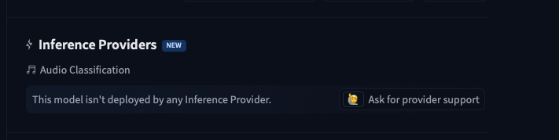

[Post 4](<!-- TODO: link -->) ended with a Raspberry Pi 5 benchmarked at 2.07 seconds per window, stable at 45°C with the official PSU and active cooler. The hardware story was done. But a model that lives in `experiments/baseline_v2/checkpoint-best` on a personal laptop is not a community contribution. It is a local artefact.

This post covers the remaining work: publishing the model, ONNX variants, and dataset to Hugging Face Hub; discovering why `pipeline_tag: audio-classification` does not give you a working inference widget; building a Gradio Space to fill that gap; and debugging four container failures — each diagnosed by pasting the HF Space log to Oz and getting a fix back in the same response. The live Space is at [huggingface.co/spaces/syamaner/coffee-first-crack-detection](https://huggingface.co/spaces/syamaner/coffee-first-crack-detection).

## The Packaging & Open Source Milestone

After two nights of work, the pipeline was validated end-to-end. The last remaining story in the epic was making it publicly accessible. The `/push-to-hub` skill — one of the four parameterised skills from [Post 1](<!-- TODO: link -->) — handled the publication sequence. I invoked it once; Oz ran the full chain from inside the Warp terminal.

The chain had three parts. First, the model. `model.push_to_hub(repo_id)` and `extractor.push_to_hub(repo_id)` are the Hugging Face-native packaging contract — both the model weights and the `ASTFeatureExtractor` configuration land together at `syamaner/coffee-first-crack-detection`. Any consumer calling `ASTForAudioClassification.from_pretrained("syamaner/coffee-first-crack-detection")` gets everything they need in one call. The model card is uploaded separately with an explicit `HfApi.upload_file` call — `push_to_hub()` publishes weights, but it does not guarantee the README lands correctly.

Before the upload, `_validate_model_card()` runs:

```python
# scripts/push_to_hub.py
def _validate_model_card(model_dir: Path) -> None:
    ...
    required = {"pipeline_tag", "license", "base_model"}
    missing = required - set(metadata or {})
    if missing:
        raise ValueError(f"README.md frontmatter missing required fields: {missing}")
```

This is spec-driven development enforcing itself. One missing field in the model card and the publish fails before a single byte reaches the Hub.

Second, the ONNX variants. Both the FP32 (345MB) and INT8 (89.9MB) models were uploaded under `onnx/fp32/` and `onnx/int8/` subfolders on the same model repo. Each subfolder includes a copy of `preprocessor_config.json`, making every variant self-contained:

```python
ASTFeatureExtractor.from_pretrained(
    "syamaner/coffee-first-crack-detection", subfolder="onnx/int8"
)
```

A Raspberry Pi with no repo clone can download and run the INT8 model with a single Hub call. That was the design goal from the beginning — `hf_hub_download` as the deployment primitive, not `scp`.

Third, and most importantly: the dataset. `DatasetDict.push_to_hub("syamaner/coffee-first-crack-audio")` published all 973 annotated chunks — train, val, and test splits — with audio cast to 16kHz at push time. Anyone pulling the dataset gets properly formatted audio without running the four-step chunking pipeline from [Post 2](<!-- TODO: link -->).

The dataset at [huggingface.co/datasets/syamaner/coffee-first-crack-audio](https://huggingface.co/datasets/syamaner/coffee-first-crack-audio) is, as far as I can determine, the first public annotated audio dataset for coffee roasting first crack detection — not on Hugging Face, not on Kaggle, not in any academic paper. The model weights are useful to anyone replicating this specific setup. The dataset is the contribution that remains useful even if someone rebuilds with a different architecture, adds more recording sessions, or trains for a different roasting event entirely. A model is one implementation. A labelled dataset is infrastructure.

## The Widget Illusion

The model card had `pipeline_tag: audio-classification`. I assumed that was enough. On any Hugging Face model page for a supported architecture, that tag generates an inference widget — upload a file, click Compute, get predictions. I pushed the model and opened the Hub page.

The widget area read: **"This model isn't deployed by any Inference Provider."**



Hugging Face inference widgets require the model to be actively served by a provider. That means either HuggingFace's own Inference Endpoints service (a paid deployment) or one of their commercial partners, who automatically serve high-traffic models. A custom AST fine-tune uploaded to a personal namespace does not qualify for automatic hosting. `pipeline_tag` describes the model type; it does not provision compute.

The attempt was to add a `widget` YAML block with example audio URLs — the documented approach for pre-loading inputs into an inference widget (commit [`1cf2b21`](https://github.com/syamaner/coffee-first-crack-detection/commit/1cf2b21d1caa3f03d603cec4da1198e81c0d3026)):

```yaml
# README.md (HF model card frontmatter)
widget:
  - src: https://huggingface.co/syamaner/coffee-first-crack-detection/resolve/main/audio_examples/first_crack_sample.wav
    example_title: "First crack (10s clip)"
  - src: https://huggingface.co/syamaner/coffee-first-crack-detection/resolve/main/audio_examples/no_first_crack_sample.wav
    example_title: "No first crack (10s clip)"
```

It did nothing. Without a deployed provider, the entire widget panel is absent from the page. The `widget` block is metadata for a UI component that never renders — HF ignores it completely when there is no inference backend. The documentation implies this block enriches your model page; the reality is it only enriches the widget that requires a provider you don't have.

The correct path was a Gradio Space. HuggingFace's community inference model is the Space: a containerised app that you own, instrument, and deploy yourself, running on their free CPU tier. `pipeline_tag` signals intent. A Space delivers it.

## The Pivot to Gradio

A HuggingFace Space is a Git repository with a `README.md` containing YAML frontmatter that tells HF's runtime what to run and how. The entire configuration for this Space is seven lines:

```yaml
# spaces/README.md
sdk: gradio
sdk_version: "6.11.0"
app_file: app.py
pinned: false
license: apache-2.0
models:
  - syamaner/coffee-first-crack-detection
```

HF provisions a container, installs the dependencies from `spaces/requirements.txt`, and runs `app.py`. The Space gets a public URL. That is the entire deployment pipeline — no Dockerfile, no Kubernetes manifest, no CI configuration.

I specified the UI requirements: a dropdown to select example clips, an audio upload component, a classify button, and a label output showing the two-class probabilities. Oz built the initial `spaces/app.py` in one pass as part of [PR #28](https://github.com/syamaner/coffee-first-crack-detection/pull/28), using `gr.Blocks` for layout control rather than the higher-level `gr.Interface`:

```python
# spaces/app.py
with gr.Blocks(title="☕ Coffee First Crack Detection") as demo:
    with gr.Row():
        with gr.Column():
            example_dd = gr.Dropdown(choices=list(_EXAMPLES), label="Try an example")
            audio_in   = gr.Audio(type="filepath", label="Upload Audio (WAV / MP3)")
            submit_btn = gr.Button("Classify", variant="primary")
        with gr.Column():
            output = gr.Label(num_top_classes=2, label="Prediction")

    example_dd.change(fn=load_example, inputs=example_dd, outputs=audio_in)
    submit_btn.click(fn=classify, inputs=audio_in, outputs=output)
```

Copilot's review of PR #28 caught the most important structural issue: the original implementation initialised the pipeline at import time — `_pipe = pipeline(...)` running unconditionally on module load. In a containerised Space, this means a cold-start crash if the Hub is temporarily unreachable during startup, with no error surfaced to the user. Copilot flagged it; the fix was a lazy initialisation pattern:

```python
# spaces/app.py
_pipe: object = None

def _get_pipe() -> object:
    global _pipe
    if _pipe is None:
        _pipe = hf_pipeline("audio-classification", model=_REPO_ID)
    return _pipe
```

The pipeline now loads on the first inference call and is cached for subsequent requests. A startup failure becomes a user-visible `gr.Error` on first classify, not a silent container crash.

Copilot also flagged that `spaces/requirements.txt` listed neither `gradio` nor `huggingface-hub` explicitly — both were implicit transitive dependencies. The explicit `gradio==6.11.0` pin was added; without it the Space is not reproducible outside the HF runtime. PR #28 was the most Copilot-reviewed PR after #23: 10 inline comments across three review passes.

The first deployment did not work. Four container failures, in sequence, before the Space came up cleanly.

## Agentic Debugging in the Container

Container debugging on HF Spaces follows a specific loop: deploy → wait for build → open the Space logs in the browser → read the error — then copy it across to Oz. Unlike the RPi5 work in [Post 4](<!-- TODO: link -->), where Oz was SSHed in and running commands directly, Space logs live in HuggingFace's web UI. The human-in-the-loop work here was exactly that: reading the HF log output, copying the relevant error, and handing it to Oz in Warp to diagnose and fix. Four iterations of that loop before the Space came up cleanly.

Three of the four failures were straightforward once the error landed in the session. They are collapsed here:

| Bug | Symptom in container log | Fix |
|-----|--------------------------|-----|
| `colorFrom: "brown"` in Space YAML frontmatter | HF rejected the metadata — `brown` is not a valid HF Space colour | Changed to a valid colour value |
| `sdk_version: "5.0.0"` → Gradio 5.x imported `HfFolder`, removed from `huggingface_hub` 0.23+ | `ImportError: cannot import name 'HfFolder' from 'huggingface_hub'` | Bump `sdk_version` to `"6.11.0"` ([`a12c46e`](https://github.com/syamaner/coffee-first-crack-detection/commit/a12c46e)) |
| `hf_hub_download()` returns path in `/root/.cache/huggingface/` — outside Gradio 6.x allowed directories | `gradio.exceptions.InvalidPathError: Cannot move /root/.cache/huggingface/hub/...` | Add `local_dir="/tmp"` ([`882559e`](https://github.com/syamaner/coffee-first-crack-detection/commit/882559e)) |

Each was a one-commit fix. None would have appeared in local testing — they are specific to the containerised HF runtime. The workflow was the same each time: read the HF log in the browser, paste the error to Oz, get the fix, push, repeat.

### The SSR Bug

The fourth failure was the one worth dissecting. After the first three fixes landed, the Space built successfully — the build log showed no errors. Then this appeared at startup:

```
Running on local URL: http://0.0.0.0:7860, with SSR ⚡ (experimental, to disable set ssr_mode=False in launch())
```

Followed by a crash that did not surface as a build failure but as a runtime `ValueError` in the Space logs ([issue #32](https://github.com/syamaner/coffee-first-crack-detection/issues/32)):

```
ValueError: Invalid file descriptor: -1
  File "asyncio/base_events.py", BaseEventLoop.__del__
```

The error came from Python's asyncio event loop destructor. Gradio 6.x creates intermediate event loops during startup. When those loops are garbage-collected, `BaseEventLoop.__del__` tries to close an already-invalid file descriptor (-1). The traceback is logged as `Exception ignored in:` — Python catches and discards it. The app runs correctly; the error is cosmetic.

The initial diagnosis pointed to Gradio's experimental SSR mode, which is enabled by default. Adding `ssr_mode=False` to `demo.launch()` removed the SSR startup banner but did not suppress the GC error — it occurs regardless of SSR state, on both Python 3.12 and 3.13.

The actual fix was a monkey-patch applied before Gradio is imported, suppressing the specific `ValueError` during event loop cleanup:

```python
# spaces/app.py — applied before `import gradio`
import asyncio.base_events as _base_events

def _patch_asyncio_event_loop_del():
    original_del = getattr(_base_events.BaseEventLoop, "__del__", None)
    if original_del is None:
        return
    # Idempotency guard — avoid stacking wrappers on importlib.reload()
    if getattr(original_del, "_spaces_app_patched", False):
        return
    def _patched_del(self):
        try:
            original_del(self)
        except ValueError as exc:
            # Suppress only the exact -1 fd error; re-raise anything else
            if str(exc) != "Invalid file descriptor: -1":
                raise
    _patched_del._spaces_app_patched = True
    _base_events.BaseEventLoop.__del__ = _patched_del

_patch_asyncio_event_loop_del()
```

I pasted the HF Space log to Oz, got the SSR diagnosis, pushed the `ssr_mode=False` fix, and confirmed the error persisted. A second search identified the root cause as Gradio's event loop lifecycle, not SSR specifically. The monkey-patch landed as a follow-up. Two iterations of the same human-in-the-loop pattern: read the log, paste to Oz, push the fix, verify.

## CI/CD: What Was Designed

Every change to the model card, dataset card, or Space currently requires a manual upload to HuggingFace Hub. Three repos, three separate operations — easy to forget, easy to get out of sync. After PR #28 landed, I filed [issue #34](https://github.com/syamaner/coffee-first-crack-detection/issues/34) to automate it.

The design: a single GitHub Actions workflow triggered on every push to `main`, running three parallel jobs:

| Source file | HF repo | Destination |
|---|---|---|
| `README.md` | `syamaner/coffee-first-crack-detection` (model) | `README.md` |
| `data/DATASET_CARD.md` | `syamaner/coffee-first-crack-audio` (dataset) | `README.md` (renamed) |
| `spaces/app.py`, `spaces/README.md`, `spaces/requirements.txt` | `syamaner/coffee-first-crack-detection` (space) | same filenames |

The approach uses `HfApi.upload_file` rather than a full git-push sync — the model card is a single file at the repo root, and the dataset card requires renaming on upload. Selective file upload is simpler than mirroring the entire repository. An `HF_TOKEN` secret in GitHub Actions is the only prerequisite.

This is still open. It is not a complex workflow to write — the issue body has the full design — but blog post drafting took priority. It is the last gap between "it works" and "it stays consistent without manual intervention."

## The Result

The Space is live at [huggingface.co/spaces/syamaner/coffee-first-crack-detection](https://huggingface.co/spaces/syamaner/coffee-first-crack-detection). Upload a 10-second WAV or MP3, click Classify, and you get the model's probability output for `first_crack` and `no_first_crack`.



What the series delivered: a complete, public, reproducible audio ML pipeline — from recording sessions and Label Studio annotation through Hugging Face-native training, ONNX INT8 edge deployment, and a live inference UI. The model, dataset, and ONNX variants are all on the Hub. The source is on GitHub. The first public coffee roasting audio dataset is available for anyone who wants to build something different with it.

The prototype that started this ran on a laptop. This one runs on a $60 ARM board, or in a browser.

---

## Links

**Project:**
- [GitHub Repository](https://github.com/syamaner/coffee-first-crack-detection)
- [Hugging Face Model](https://huggingface.co/syamaner/coffee-first-crack-detection)
- [Hugging Face Dataset](https://huggingface.co/datasets/syamaner/coffee-first-crack-audio)
- [Live Gradio Space](https://huggingface.co/spaces/syamaner/coffee-first-crack-detection)

**Tools:**
- [Warp — The Agentic Development Environment](https://www.warp.dev/)
- [Oz — Warp's AI Agent](https://docs.warp.dev/ai)

---

## References

#### 1. Hugging Face Spaces & Gradio

- **[Hugging Face Spaces Documentation](https://huggingface.co/docs/hub/spaces)** — Covers the `README.md` YAML frontmatter, SDK options, and container lifecycle that drove the deployment approach here.
- **[Gradio Blocks Documentation](https://www.gradio.app/docs/gradio/blocks)** — `gr.Blocks` is used rather than `gr.Interface` for layout control over the two-column input/output arrangement.

#### 2. Hugging Face Inference Providers

- **[HF Inference Providers Documentation](https://huggingface.co/docs/inference-providers/index)** — Documents which model types are eligible for automatic inference widget hosting and which require explicit provider deployment. The gap between `pipeline_tag` and a working widget is explained here.

#### 3. Python asyncio & Gradio Event Loop Cleanup

- **[CPython asyncio `BaseEventLoop.__del__`](https://github.com/python/cpython/blob/main/Lib/asyncio/base_events.py)** — The destructor that raises `ValueError: Invalid file descriptor: -1` when garbage-collecting event loops whose self-pipe is already closed. Affects Python 3.12 and 3.13 when Gradio creates intermediate loops during startup.
